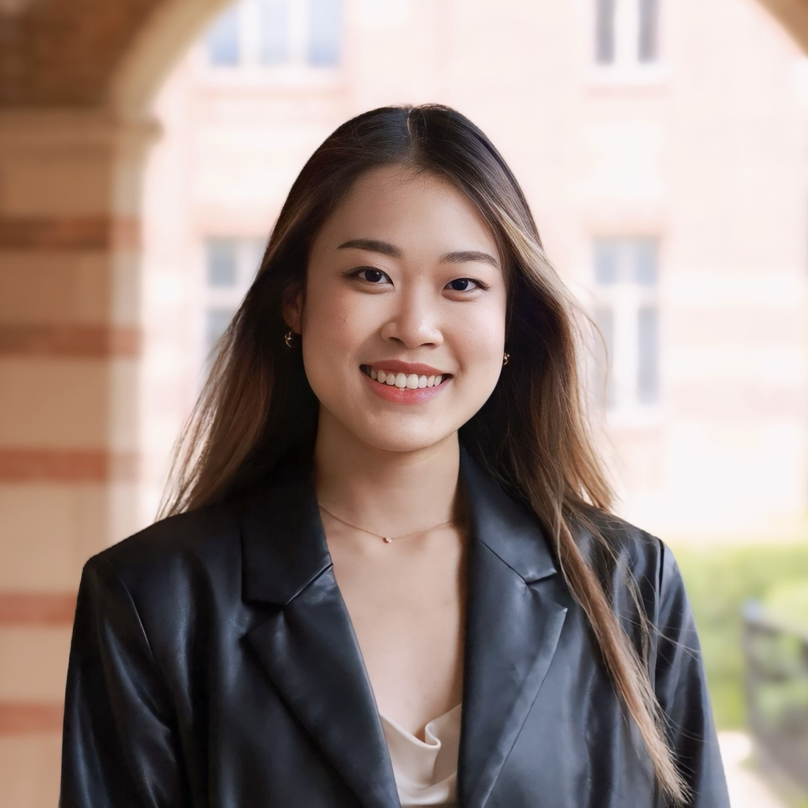

:::: {.home-intro}
::: {.home-bio}
PhD Candidate in Bioengineering · UCLA

I am a PhD candidate in Bioengineering at UCLA, advised by Dr. William Hsu in the [Hsu Lab](https://www.hsu-lab.com/). My research focuses on multimodal learning, generative models, and computational pathology. I develop machine learning methods that combine complementary medical data and improve how models generalize across imaging domains, with applications to cancer prognosis and medical image analysis.

Previously, I earned a B.S. in Computer Science and a B.A. in Gender Studies at UCLA. As an undergraduate, I worked with [Dr. William Hsu](https://www.hsu-lab.com/) on multimodal approaches to cancer prognosis and with [Dr. Demetri Terzopoulos](https://web.cs.ucla.edu/~dt/) on medical image segmentation.

:::
::: {.home-portrait}
{fig-alt="Portrait of Tengyue (Olivia) Zhang" width=220 height=220}
:::
::::

## News

- **September 3, 2026:** Advanced to PhD candidacy in Bioengineering at UCLA.
- **August 14, 2026:** Our paper, [“Semi-Supervised Domain Adaptation with Latent Diffusion for Pathology Image Classification”](https://doi.org/10.1109/JBHI.2026.3727978), was accepted at *IEEE Journal of Biomedical and Health Informatics (JBHI)*.
- **May 26, 2026:** Presented “Target-Aware Domain Adaptation for Pathology Image Classification via Latent Diffusion Models” at UCLA Bioengineering Research Day.
- **February 3, 2026:** Awarded the UCLA Bioengineering Graduate Fellowship for Spring 2026.

## Research interests

- Multimodal learning for medical data
- Generative models and domain adaptation
- Computational pathology and cancer prognosis

## Contact

Email: olivia [dot] zhang [at] ucla [dot] edu

```{=html}
<div class="contact-links" aria-label="Social profiles">
  <a class="contact-icon" href="https://scholar.google.com/citations?user=uWzRYTwAAAAJ&amp;hl=en" aria-label="Google Scholar profile" title="Google Scholar">
    <svg viewBox="0 0 24 24" aria-hidden="true" focusable="false"><path d="M5.242 13.769L0 9.5 12 0l12 9.5-5.242 4.269C17.548 11.249 14.978 9.5 12 9.5c-2.977 0-5.548 1.748-6.758 4.269zM12 10a7 7 0 1 0 0 14 7 7 0 0 0 0-14z"/></svg>
  </a>
  <a class="contact-icon" href="https://www.linkedin.com/in/tengyue-olivia-zhang" aria-label="LinkedIn profile" title="LinkedIn">
    <i class="bi bi-linkedin" aria-hidden="true"></i>
  </a>
  <a class="contact-icon" href="https://x.com/zhtyolivia?s=11" aria-label="X profile" title="X">
    <i class="bi bi-twitter-x" aria-hidden="true"></i>
  </a>
</div>
```
