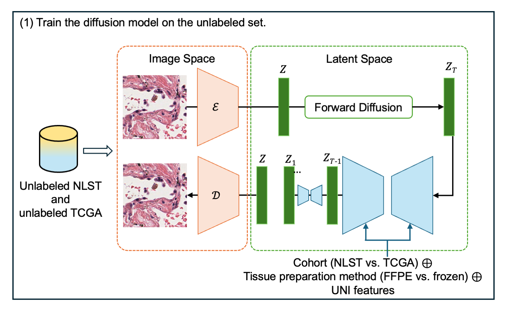
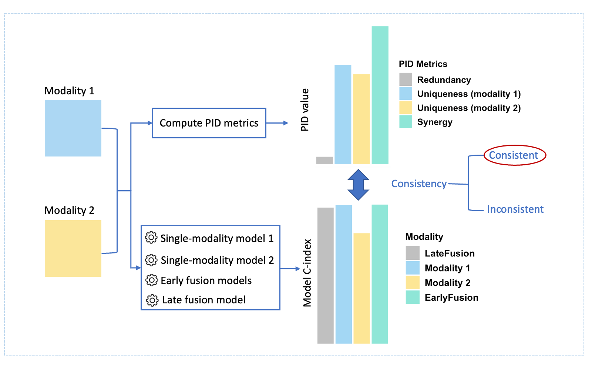
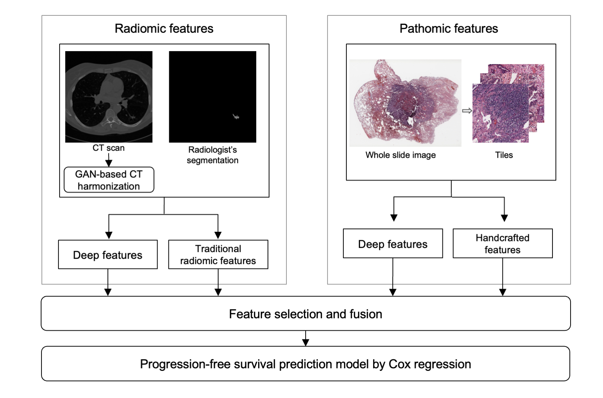
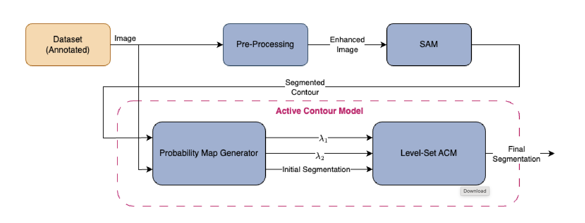

::: {.publications-page}
::: {.publications-intro}
My work explores how to combine complementary medical data and build models that generalize across imaging domains.

[All publications on Google Scholar](https://scholar.google.com/citations?user=uWzRYTwAAAAJ&hl=en) · **\* Equal contribution**
:::

:::: {.publication-entry}
::: {.publication-visual}
[{fig-alt="Latent diffusion model trained on unlabeled NLST and TCGA pathology images, conditioned on cohort, tissue preparation, and UNI features."}](images/pathology-domain-adaptation-overview.png)

[View full-size figure](images/pathology-domain-adaptation-overview.png){.figure-link}
:::
::: {.publication-copy}
[2026 · Preprint]{.publication-venue}

## Semi-Supervised Domain Adaptation with Latent Diffusion for Pathology Image Classification {#pathology-domain-adaptation}

[**Tengyue Zhang**, Ruiwen Ding, Luoting Zhuang, Yuxiao Wu, Erika F. Rodriguez, William Hsu]{.publication-authors}

We use a latent diffusion model trained on unlabeled source and target images to generate pathology images that preserve tissue morphology while incorporating target-domain appearance. Adding these synthetic images to classifier training improved lung adenocarcinoma growth-pattern classification on a held-out target cohort, increasing weighted F1 from 0.611 to 0.706.

::: {.publication-links}
[Paper (PDF)](papers/pathology-domain-adaptation.pdf){.publication-button aria-label="Read the pathology domain adaptation preprint PDF"}
[Code](https://github.com/hsu-lab/ldm-pathology-ssda){.publication-button aria-label="Code for pathology domain adaptation"}
:::
:::
::::

:::: {.publication-entry}
::: {.publication-visual}
[{fig-alt="Evaluation framework comparing partial information decomposition metrics with single-modality, early-fusion, and late-fusion model performance."}](images/pid-evaluation-overview.png)

[View full-size figure](images/pid-evaluation-overview.png){.figure-link}
:::
::: {.publication-copy}
[2025 · Journal of Biomedical Informatics, 167, 104833]{.publication-venue}

## Evaluating an information theoretic approach for selecting multimodal data fusion methods {#multimodal-fusion}

[**Tengyue Zhang\***, Ruiwen Ding\*, Kha-Dinh Luong, William Hsu]{.publication-authors}

Can information theory tell us how to combine medical data? We evaluated partial information decomposition across seven modality pairs from four biomedical cohorts. The metrics did not consistently identify the best-performing fusion strategy; we investigated parameter selection and uncertainty estimation to improve their reliability.

::: {.publication-links}
[Paper (PDF)](papers/multimodal-fusion-evaluation.pdf){.publication-button aria-label="Read the multimodal fusion evaluation paper PDF"}
[DOI](https://doi.org/10.1016/j.jbi.2025.104833){.publication-button aria-label="Publisher page for multimodal fusion evaluation"}
[Code](https://github.com/zhtyolivia/pid-multimodal){.publication-button aria-label="Code for multimodal fusion evaluation"}
:::
:::
::::

:::: {.publication-entry}
::: {.publication-visual}
[{fig-alt="CT-derived radiomic features and whole-slide pathology features are selected and fused for progression-free survival prediction with Cox regression."}](images/radiopathomic-fusion-overview.png)

[View full-size figure](images/radiopathomic-fusion-overview.png){.figure-link}
:::
::: {.publication-copy}
[2024 · SPIE Medical Imaging: Digital and Computational Pathology]{.publication-venue}

## Using integrated radiomic and pathomic-based models to predict progression-free survival in early-stage lung adenocarcinoma {#radiopathomic-fusion}

[**Tengyue Zhang\***, Anil Yadav\*, Ruiwen Ding\*, Sean Johnson, Denise Aberle, Ashley Prosper, Erika Rodriguez, Ana Cristina Araujo Lemos da Silva, William Hsu]{.publication-authors}

We combined features from CT scans and whole-slide pathology images to predict progression-free survival in 106 patients from the National Lung Screening Trial. With repeated five-fold cross-validation, the fused Cox model achieved a mean test C-index of 0.634, compared with 0.612 for radiomics alone and 0.584 for pathomics alone.

::: {.publication-links}
[Paper (PDF)](papers/radiopathomic-fusion.pdf){.publication-button aria-label="Read the radiomic and pathomic fusion paper PDF"}
:::
:::
::::

:::: {.publication-entry}
::: {.publication-visual}
[{fig-alt="Medical images pass through preprocessing and the Segment Anything Model, followed by a probability map generator and level-set active contour refinement."}](images/sam-acm-overview.png)

[View full-size figure](images/sam-acm-overview.png){.figure-link}
:::
::: {.publication-copy}
[2024 · SPIE Medical Imaging: Computer-Aided Diagnosis]{.publication-venue}

## Refining Boundaries of the Segment Anything Model in Medical Images Using an Active Contour Model {#sam-active-contours}

[Noor Nakhaei, **Tengyue Zhang**, Demetri Terzopoulos, William Hsu]{.publication-authors}

We combine the Segment Anything Model with a level-set active contour model to refine medical image boundaries at test time. Evaluated on skin lesion and retinal vessel datasets, the approach addresses segmentation errors in images with low contrast or artifacts without additional supervised fine-tuning of SAM.

::: {.publication-links}
[Paper (PDF)](papers/sam-active-contours.pdf){.publication-button aria-label="Read the SAM active contour refinement paper PDF"}
[DOI](https://doi.org/10.1117/12.3006255){.publication-button aria-label="Publisher page for SAM active contour refinement"}
:::
:::
::::
:::
